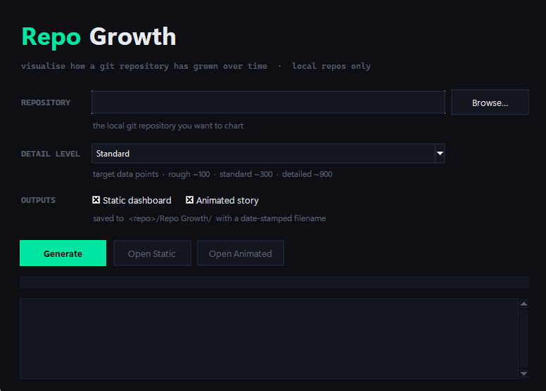

# repo-growth

Visualise how a Git repository has grown over time. Generates self-contained, interactive HTML — your choice of a **static dashboard**, an **animated scroll-through story**, or both.



*Point it at a local repo, pick a detail level, choose your outputs, and click Generate.*

The **static dashboard** charts lines of code (by commit number and by date), total files, average file size, churn (added/removed), commits per week, contributors over time, commits by day of week and hour of day, and a stacked breakdown by file type (with an "other" band so the bands sum to the real total). Above the charts sits a grid of ~20 summary stats: peak lines, repo age, average growth/day, code-survival rate, dominant file type, contributor count, busiest week/day, night-owl share, longest active streak and gap, largest/median file, biggest single addition and cleanup, and more.

The **animated story** replays that history as you scroll — chapter by chapter through lines, files, file types, churn and contributors — with milestone callouts (1k/10k/100k…) flashing in as the line crosses them, a **▶ play** button that auto-scrolls the whole thing, and a count-up stat summary at the end.

Works on local clones — including private repos. The analysis runs entirely on your machine, and the generated pages embed their own fonts, so an open chart makes **no network requests** at all. Share or archive a single HTML file that renders identically offline.

## Download

Prefer not to install Python? Grab a ready-to-run build from the [Releases page](../../releases):

- **Windows** — `RepoGrowth-windows.exe`
- **macOS** — `RepoGrowth-macos.zip` (unzip to get `RepoGrowth.app`; see the note below)
- **Linux** — `RepoGrowth-linux` (`chmod +x RepoGrowth-linux`, then run it)

These bundle Python and all dependencies, so there's nothing to install — **except Git**, which Repo Growth still calls to read repositories, so it must be installed and on your `PATH`.

> **macOS first launch:** the app is unsigned, so macOS blocks it the first time. Right-click `RepoGrowth.app` → **Open** → **Open**, or run `xattr -dr com.apple.quarantine RepoGrowth.app`. After that it opens normally.

## Install

```bash
pip install -r requirements.txt
```

Requires Python 3.8+ and `git` on your `PATH`. The GUI uses Tkinter, which ships
with Python on Windows and macOS; on some Linux distributions it's a separate
package (e.g. `sudo apt install python3-tk`).

## Usage

```bash
python main.py
```

The Tk GUI opens. Pick a repository folder, optionally enter a branch, choose a **Detail level**, tick which **Outputs** you want (**Static dashboard** and/or **Animated story**), then click **Generate**. Progress streams to the log panel; **Open Static** / **Open Animated** launch each result when it's done.

Files are saved inside the target repo at `<repo>/Repo Growth/<repo>_growth_<YYYY-MM-DD>.html` (the animated one gets an `_animated` suffix). The folder is created automatically.

> Tip: add `Repo Growth/` to that repo's `.gitignore` to keep generated charts out of version control.

## Detail levels

The script samples commits evenly across history and always includes the newest commit, so the right-hand edge reflects current state.

| Level    | Target points | Notes                                                   |
|----------|--------------:|---------------------------------------------------------|
| Rough    | ~100          | Fastest. Coarse line for very large repos.              |
| Standard | ~300          | Balanced default.                                       |
| Detailed | ~900          | Near-every-commit on small/medium repos; slow on huge.  |

## How it works

For each sampled commit, the script walks the tree and counts non-binary lines and file types. Identical file blobs are counted once and cached by content hash, so unchanged files between samples are nearly free — the main speed-up on large repos. Churn between consecutive sampled commits comes from `git diff --numstat`, and a single pass over the full history yields the contributor, day-of-week and hour-of-day distributions. Everything is bundled into a single HTML file with vanilla-canvas charts — no JS dependencies, works offline.

## Build a standalone program

The [Releases](../../releases) builds are produced with [PyInstaller](https://pyinstaller.org). To build one yourself:

```bash
pip install -r requirements-dev.txt
pyinstaller repo_growth.spec
```

The result lands in `dist/` — `RepoGrowth.exe` on Windows, `RepoGrowth` on Linux, `RepoGrowth.app` on macOS. PyInstaller only builds for the OS it runs on, so the GitHub Actions workflow ([`.github/workflows/build.yml`](.github/workflows/build.yml)) builds all three when a `v*` tag is pushed and attaches them to the Release.

## Project layout

```
main.py                          entry point — launches the GUI
gui.py                           Tk GUI; imports the analysis functions
repo_growth.py                   analysis core + HTML generators (no GUI dependency)
templates/
  template.html                  static dashboard (HTML + CSS + JS)
  template_animated.html         scroll-driven animated story
  fonts/                         bundled woff2 fonts (embedded at generation time)
repo_growth.spec                 PyInstaller build recipe (standalone program)
.github/workflows/build.yml      CI: build + publish binaries on a v* tag
requirements.txt
requirements-dev.txt             build/test tooling (PyInstaller, pytest)
LICENSE
```

- `repo_growth.py` — commit traversal, line counts, churn, contributor/time distributions, sampling, plus `generate_html` and `generate_animated_html`, which fill in the templates.
- The templates use placeholders like `{{DATA_JSON}}` that are filled in at generation time. Edit them directly to tweak styling or chart logic — no Python brace-escaping needed.
- `templates/fonts/` holds the Syne and JetBrains Mono woff2 files; the generator base64-encodes them into each page so the output is a single self-contained, offline file (see [Self-hosted fonts](#self-hosted-fonts)).

## Troubleshooting

- **`ModuleNotFoundError: No module named 'tkinter'`** — install your platform's Tk package (`sudo apt install python3-tk` on Debian/Ubuntu). Tkinter is bundled with the standard Python installers on Windows and macOS.
- **`Error: gitpython is required`** — run `pip install -r requirements.txt`.
- **"That folder doesn't look like a Git repository"** — point Repo Growth at the root of a clone (the folder containing `.git`), not a subfolder.
- **Detailed level is slow on a huge repo** — that's expected; it samples near every commit. Use Standard or Rough for very large histories.

## Limitations

- Stats are computed from **sampled** commits (see Detail levels), so churn and code-survival figures are close approximations, not exact per-commit totals. The newest commit is always included.
- Binary files are detected heuristically (a NUL byte in the first 8 KB) and excluded from line counts.
- The stacked file-type breakdown tracks a fixed set of common source extensions; everything else is grouped into an "other" band.

## Self-hosted fonts

The charts use [Syne](https://gitlab.com/bonjour-monde/fonderie/syne-typeface) and
[JetBrains Mono](https://github.com/JetBrains/JetBrainsMono), bundled under
`templates/fonts/` and embedded into each generated page as base64. Nothing is
fetched from a font CDN, so pages render the same with no internet connection.
Both fonts are licensed under the SIL Open Font License 1.1 — see
[`templates/fonts/OFL.txt`](templates/fonts/OFL.txt).

## License

[MIT](LICENSE) © Joss Redfern. The bundled fonts are licensed separately under the
SIL Open Font License 1.1.
